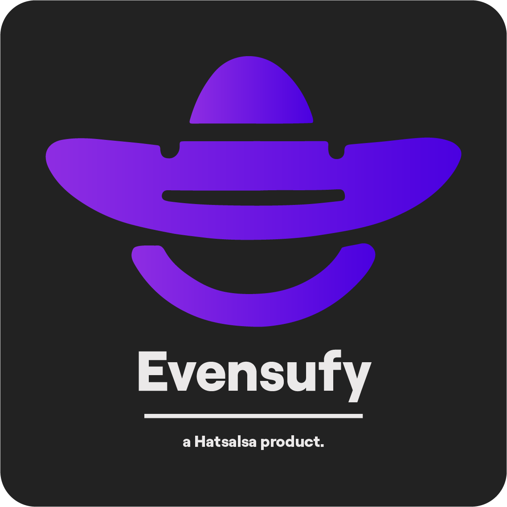
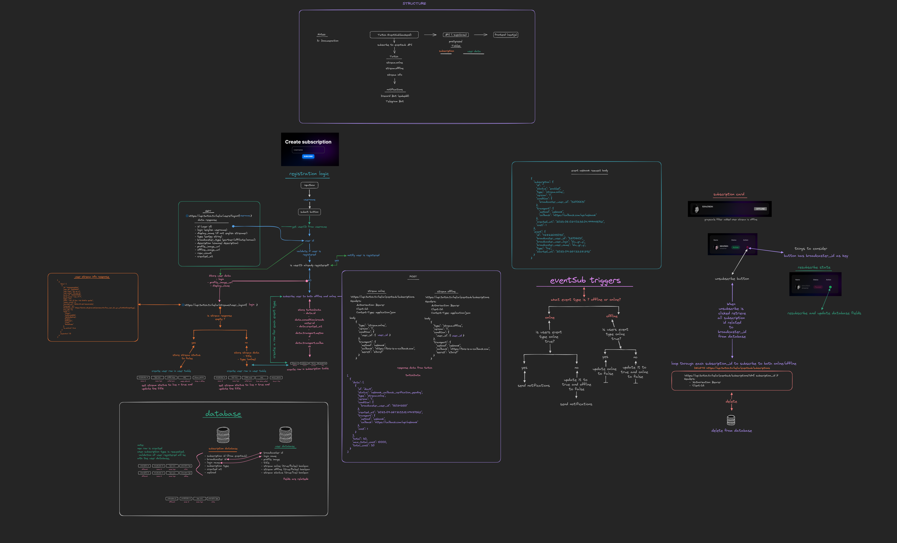

<div align="center">

</div>

----

Evensufy is a lightweight application built with Next.js and Supabase that allows you to stay connected with your favorite Twitch streamers. With Evensufy, you can effortlessly subscribe to Twitch EventSub notifications and receive instant updates when your preferred streamers go live.

---

## Features
 - **Stream Online Notifications:** Get real-time notifications on Discord through webhooks whenever a Twitch streamer you follow starts streaming.
 - Supabase realtime subscriptions.
 - Unsubscribe and Resubscribe to EventSub.
 - Supabase OAuth.

## How It Works
Evensufy utilizes Twitch EventSub to monitor streamer activities and communicates with Discord through webhooks, ensuring you never miss a moment of your favorite streams.

## Getting Started
To get started with Evensufy, follow these simple steps:

```
npm install
```
**Supabase local instance:**
>The project works with a self-hosted instance of supabase with docker if you wish to use their own hosted version you can import the project using supabase cli.
```
supbase start
```
Supabase studio:
```
http://localhost:54323
```
>**Note**: verify the database tables are created. (expected to have streamers and subscriptions tables)

```
Subscriptions table:
    "id" uuid not null default gen_random_uuid(),
    "broadcaster_id" text,
    "created_at" text,
    "method" text,
    "login_name" text,
    "subscription_id" text,
    "subscription_type" text,
    "user_id" uuid

Streamers table:
    "id" uuid not null default gen_random_uuid(),
    "broadcaster_id" text not null,
    "login_name" text,
    "profile_image" text,
    "stream_online" boolean not null,
    "stream_offline" boolean not null,
    "title" text,
    "created_at" timestamp with time zone not null default now(),
    "user_id" uuid,
    "stream_status" boolean not null,
    "subscribed" boolean not null
```

Add cretendials and api keys to the `.env` file.(see `.env.example`)

Run and open `http://localhost:3000`
```
npm run dev
```
# Technologies Used
## Development Tools and Languages:
- **TypeScript**: A superset of JavaScript that adds static typing to the language, enhancing code quality and developer productivity.
- **Next.js**: A popular React framework for building server-rendered applications.
- **Tailwind CSS**: A utility-first CSS framework.
- **NextUI**: Beautiful, fast, and modern React UI library.
- **Framer Motion**: Simple yet powerful motion library for React.
- **Postman**: An API platform for building and using APIs.

## Backend and Database Technologies:
- **Axios**: Axios is a simple promise based HTTP client for the browser and node.js.
- **Next.js API Routes**: API routes provide a solution to build a public API with Next.js
- **Supabase**: An open-source Firebase alternative for building scalable and secure applications.
- **Supabase OAuth**: Designed to work standalone or integrated with other Supabase products, utilizing Postgres' built-in Auth functionality.
- **Supabase CLI**: Provides tools for local development, deployment, database migrations, and schema-based type generation.
- **Twitch EventSub API**: Allows your application to listen for events that happen on Twitch.
- **Twitch API**: Provides tools and data used to develop Twitch integrations.
- **Twitch CLI**: Command-line interface for managing Twitch resources.

----
## Project Structure:
The app is designed to make all the subscriptions using the front-end and utilize Nextjs API routes and supabase API to integrate the back-end.
<div align="center">
</img>
</div>

## Roadmap:

- Dockerized version
- Integrate with telegram.

## Contact:
**lonus - lonus@lonusu.com**